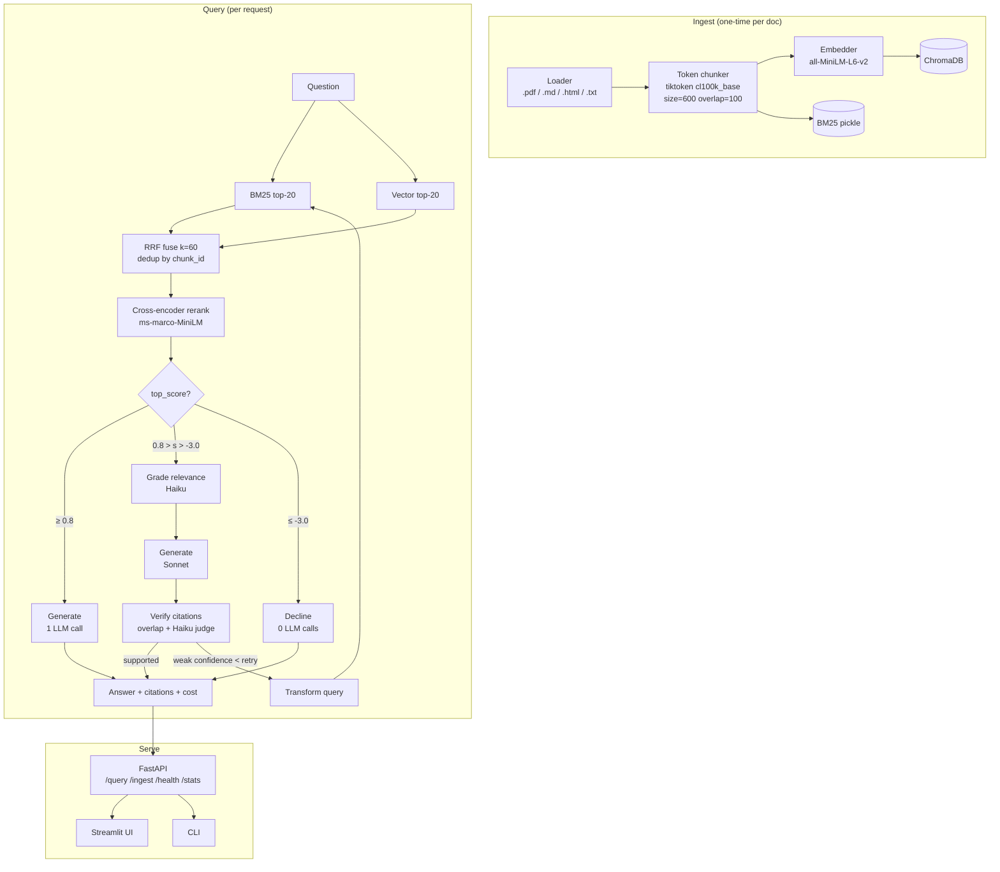

# CiteSage Architecture Overview

## 1. What it does
CiteSage answers natural-language questions against a corpus of
documents. Every factual claim in the answer is tied to a specific chunk
of a specific source. When the corpus cannot support an answer, the
system declines rather than hallucinates.

## 2. High-level flow

## 3. Key design choices

**Token-based chunking.** Using `tiktoken.get_encoding("cl100k_base")`
as the `length_function` for `RecursiveCharacterTextSplitter` keeps
chunks semantically sized for the LLM's context, not the lexer's.

**Routing by score, not LLM vote.** The cross-encoder reranker produces
a deterministic score. Routing thresholds (`confidence_threshold`,
`decline_threshold`) are knobs in `config.yaml`, not model prompts. This
keeps latency predictable and audit trails simple.

**Cite or decline.** `generate_fast`, `generate_thorough`, and `decline`
all emit a `PipelineResult` with `path_taken` + `confidence` so downstream
code never has to infer what happened.

**Grader failure is safe.** If the Haiku relevance grader returns
unparseable JSON, the pipeline declines rather than silently keeping all
chunks. Phase 3 showed the old "keep everything" fallback masked the
grader being a no-op on local models.

**Provider factory.** `utils/llm_factory.py` returns either a
`ChatAnthropic` (cloud, fast, costs cents per eval) or an `OllamaLLM`
wrapper (local, free, slower). Same prompts, same graph, same metrics;
pick by flipping `provider:` in config.

## 4. Module map

| Package            | Responsibility                                            |
| ------------------ | --------------------------------------------------------- |
| `ingestion/`       | Loaders, token chunker, ChromaDB store, BM25 pickle       |
| `retrieval/`       | BM25 + vector retriever, RRF fusion, cross-encoder rerank |
| `generation/`      | Answer generator, citation verifier                       |
| `graph/`           | LangGraph state, nodes, routing, pipeline entry point     |
| `evaluation/`      | Golden-dataset runner, LLM-judge grader, regression gate  |
| `api/`             | FastAPI app, auth, rate limit, RFC 7807 errors, stats     |
| `ui/`              | Streamlit frontend                                        |
| `utils/`           | Provider-agnostic LLM factory, cost tracker               |
| `config/`          | Pydantic-validated YAML loader                            |
| `prompts/`         | Versioned YAML prompts (no inline prompt strings)         |

## 5. Observability

Every query emits a chain of structured `structlog` events keyed by
`request_id`:

- `api.request.start` / `api.request.end` — HTTP latency
- `graph.retrieve` — BM25 / vector / overlap / RRF counts
- `graph.rerank` — candidates in, top score
- `graph.grade_relevance` — raw grader response, kept/dropped counts
- `graph.generate_fast` / `graph.generate_thorough` — token usage
- `citation_verifier.done` — supported / partial / unsupported breakdown
- `pipeline.complete` — path taken, confidence, cost

`GET /stats` aggregates these in-process; for multi-worker deployments,
swap the in-memory `StatsCollector` for a Redis-backed counter.
